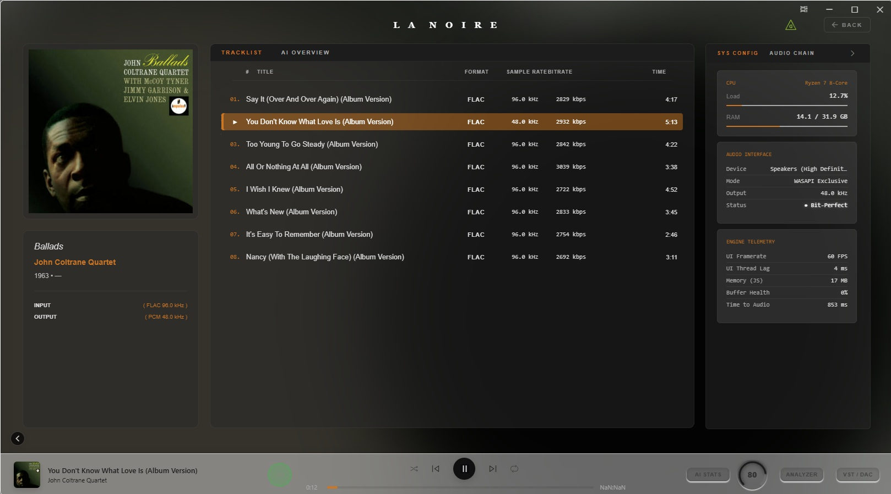
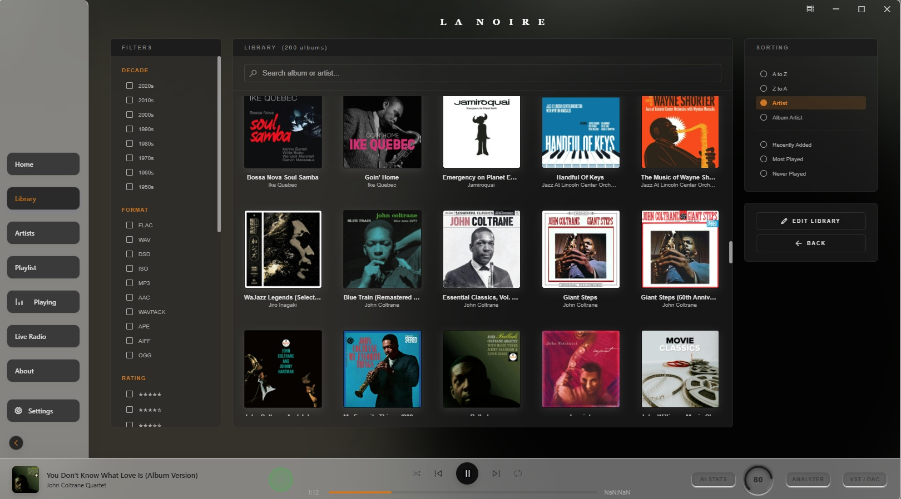
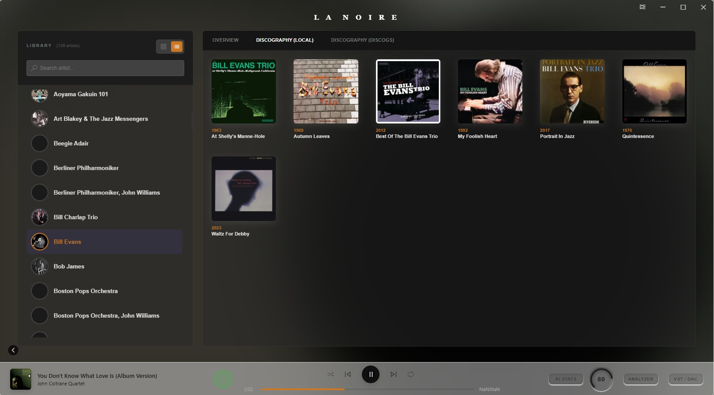
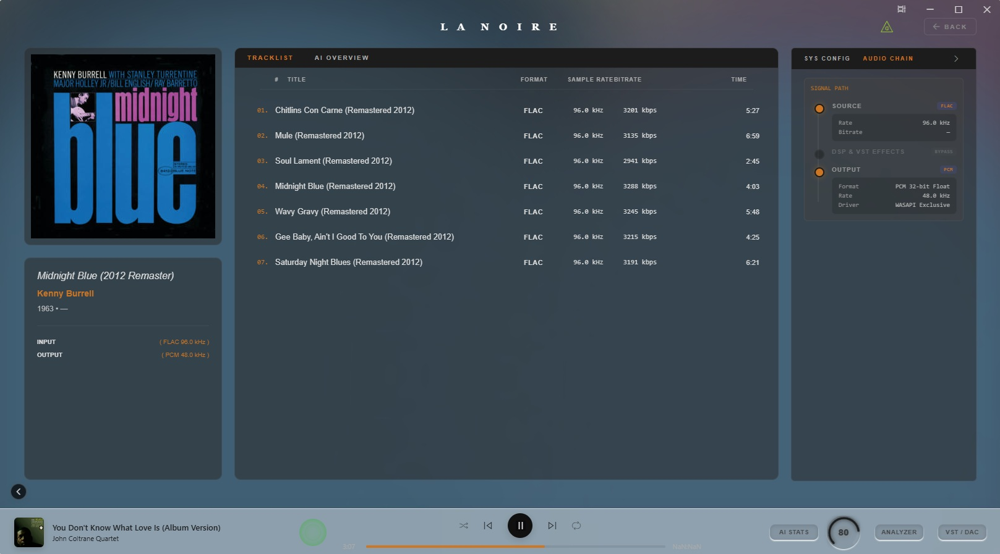

<div align="center">

# LA NOIRE

**Bit-perfect audio player for Windows — no mixer, no resampling artifacts, no compromises.**


</div>

> ⚠️ **Beta software.** Expect hardware-specific issues, especially with DACs. Not plug-and-play.

---

## Screenshots

<p align="center">
  <br>
  <sub>Now Playing — tracklist, system telemetry, audio chain status</sub>
</p>

<p align="center">
  <br>
  <sub>Library — filters by decade, format, rating</sub>
</p>

<p align="center">
  <br>
  <sub>Artist page — local + Discogs discography</sub>
</p>

<p align="center">
  <br>
  <sub>Audio chain — signal path from source to output</sub>
</p>

---

## Features

**Playback**
FLAC · WAV · ALAC · AIFF · MP3 · AAC · M4A · OGG · WavPack · DSF/DFF (ASIO Native + DoP) · CUE sheets · gapless

**Audio engine**
ASIO native (Steinberg SDK) with WASAPI exclusive fallback, bit-perfect output, DAC capability/stability probing.

**DSP**
- FIR convolution (up to 10M taps, experimental) — GPU-accelerated via OpenCL (AMD / NVIDIA / Intel)
- SoXR VHQ resampling
- PCM → DSD real-time upsampling (DSD64 → DSD256+), 5th-order Σ-Δ modulator with Hermite interpolation + look-ahead trellis
- VST3 plugin chain (JUCE host)
- ReplayGain (track/album, configurable preamp)

**Analysis**
Real-time spectrum analyzer · goniometer · True Peak / LUFS meters · test signal generator (sine, impulse, multitone, noise)

**Library**
Drag & drop playlists · smart filters · radio streaming (HTTP/ICY, M3U/PLS)

**Metadata**
Discogs · Last.fm · Groq AI summaries (albums/artists)

---

## Stack

| Layer | Technology |
|---|---|
| UI | Tauri + Vue.js |
| Audio engine | Rust (cpal, symphonia, ringbuf) |
| DSP / VST | JUCE (C++ DLL via FFI) |
| Resampling | SoXR (C++ → Rust FFI) |
| GPU FIR | OpenCL 1.2+ |
| DSD modulator | Pure Rust Σ-Δ V2.3 |

## Requirements

- Windows 10/11 64-bit
- ASIO driver recommended for DSD output
- OpenCL GPU for FIR filtering (optional, bypassed if unavailable)
- DoP-capable DAC for DSD playback

## Build

Requires: Rust toolchain, C++ compiler + ASIO SDK, OpenCL runtime.

```bash
npm install
npm run tauri build
```

*(Full platform-specific instructions: TODO)*

---

## Bug reports

Please include:

- DAC model
- Driver (ASIO/WASAPI) + version
- OS version
- Playback mode (PCM / DSD / DoP)
- Sample rate / DSD rate
- Buffer size
- Expected vs actual behavior
- Logs (ASIO + DSP if available)

## Known limitations

DAC behavior varies significantly between manufacturers. High-tap FIR modes are experimental. GPU acceleration depends on driver support.
